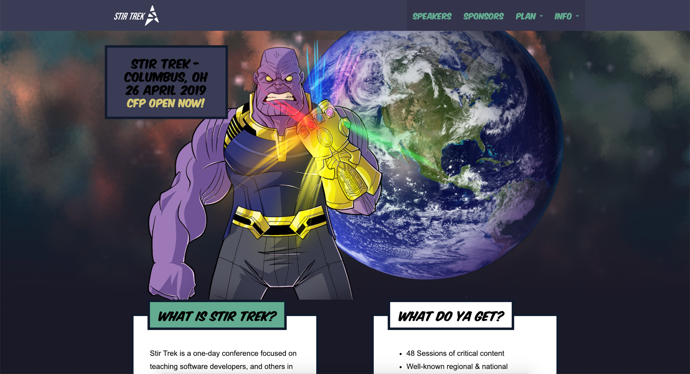

# Stir Trek 2019 Conference CFP Submissions

I am submitting a couple of talks to the upcoming [Stir Trek Conference 2019](https://stirtrek.com/). This is my author bio a long with the title and description of each presentation.

## Author Bio

Dan Vega is a self-taught programmer with nearly 20 years of experience. Throughout his career, he has worked with a variety of languages, frameworks, and tools. Dan has used his knowledge, passion, and influence to help developers of all skill levels to achieve their goals. He teaches on his Blog, YouTube channel, and has over 65,000 students in his online courses.

Dan believes that having a passion for learning is the secret to his success. He has continued to advance to different positions and companies over the years which has led him to Tech Elevator, a coding bootcamp that helps students learn how to code in just 14 weeks. As a curriculum developer, he is responsible for keeping the curriculum up to date in this fast-paced industry.

## Static Site Generators in VueJS

While large server-side monolithic applications still exist, the industry is in the middle of a major shift away from them. With the advancement of JavaScript frameworks and the language itself, we are pushing more and more to the client these days. This trend in web development has been dubbed JAMStack, which stands for JavaScript + API + Markup.

With the shift towards JAMStack, Static Site Generators (SSGs) are becoming more and more popular. In this session, we are going to clear up any questions you might have about what SSGs are and what you can build with them. Specifically, we are going to look at the landscape of SSGs in the Vue ecosystem. We will create a simple application and discuss your options for deploying your static site.

## Acquire new skills fast: A guide to continued learning and personal growth

A popular Chinese proverb states: “The best time to plant a tree was 20 years ago. The second best time is now.” Dan Vega, a self-taught programmer with 20+ years of experience in Software Development, will share life lessons that helped turn his lifelong passion for learning (and teaching) into an exciting career.

Do you find yourself overwhelmed with a list of things you would like to learn but have no idea where to start? In this session, we will debunk myths that it takes monumental amounts of effort and time to learn a new skill. You will walk away from this presentation with a specific plan on how you can acquire new skills rapidly.
